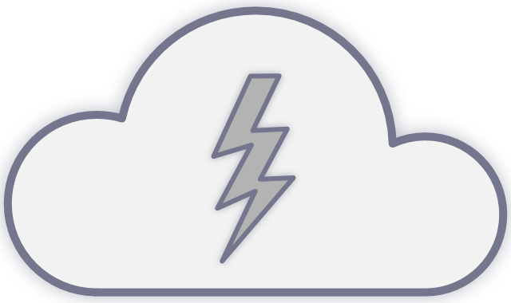

Command-line weather using the Open Weather API

## Example

### Configuration

## Building

### Requirements
- C++20
- [CMake](https://cmake.org)

### Instructions

## Links
[Open Weather API](https://openweathermap.org)

## Contact
Created by [@brianjgamble](https://www.brianjgamble.com)
